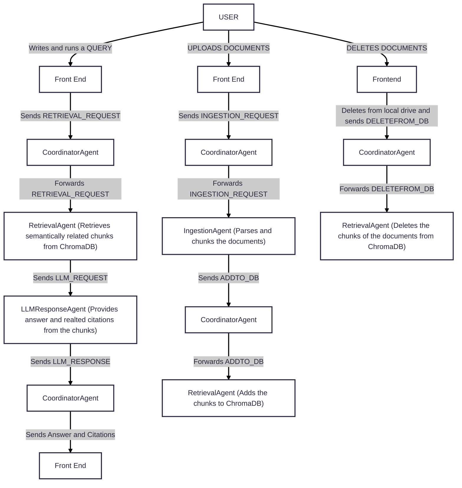
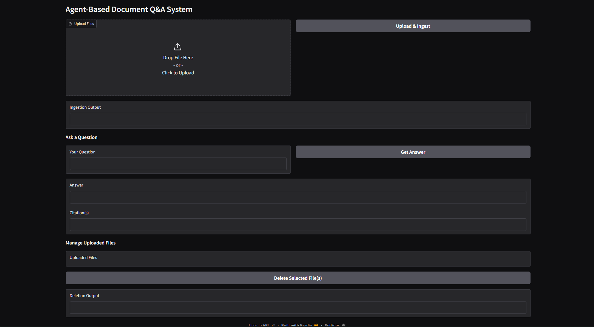

# Agent-Based Document Q&A System

This project implements a modular agent-based pipeline for intelligent document understanding and question-answering. It supports PDF, DOCX, PPTX, CSV, and TXT/MD ingestion with persistent vector storage using ChromaDB, and returns grounded answers using LLMs via MCP (Model Communication Protocol).

## Table of Contents
- Overview

- Architecture

- File Structure & Descriptions

- Features

- Installation

- Usage

- Agent Responsibilities

- MCP Protocol

- Future Enhancements

## Overview
This system allows users to upload unstructured documents through a clean Gradio UI. The documents are chunked, embedded, and indexed in ChromaDB. On querying, relevant chunks are retrieved and passed to an LLM to generate a citation-rich, context-aware answer.

All communication between agents (Ingestion, Retrieval, LLM, Coordinator) follows a unified MCPMessage protocol, enabling modularity and easy debugging.

## Architecture


## Files & Function Descriptions
### `app.py` - Frontend & File Control Layer
This file defines the UI using Gradio and managesd local file storage.
#### Key Functions:
- `upload_and_ingest(file)`: Saves the uploaded file to disk with indexed name (e.g. report_1.pdf), sends an INGESTION_REQUEST to the CoordinatorAgent.

- `delete_file(filename)`: Sends a DELETEFROM_DB message to CoordinatorAgent and removes the file from local storage

- `list_local_files()`: Returns sorted list of currently indexed file names.

- `query_files(user_query)`: Sends a RETRIEVAL_REQUEST to the CoordinaterAgent chain for the selected file and returns the final answer.

- `get_indexed_filename(original_name)`: Generates indexed file name like example_1.pdf to handle duplicates.

### `coordinator_agent.py` — Central Message Router
This agent receives MCPMessages from the UI and forwards them to the correct backend agent.

#### Key Functions
- handle_message(message: MCPMessage):

    - Forwards the message to:

        - `IngestionAgent.add()` if `type == INGESTION_REQUEST`

        - `RetrievalAgent.add_chunks()` if `type == ADDTO_DB`

        - `RetrievalAgent.delete_chunks()` if `type == DELETEFROM_DB`

        - `RetrievalAgent.query()` if `type == RETRIEVAL_REQUEST`

        - `LLMResponseAgent.answer()` if `type == LLM_REQUEST`

        - Returns final LLMResponse to the UI.

### `ingestion_agent.py` — File Chunking & DB Ingestion

Processes file content and pushes it into ChromaDB.

#### Key Functions:

- `add(message: MCPMessage)`:

    - Extracts file path from message.

    - Parses content using file_parser.py

    - Chunks content using chunking.py

    - Returns a new MCPMessage of type ADDTO_DB to the CoordinatorAgent with the list of chunks.

### `retrieval_agent.py` — Vector Search Layer
Handles chunk embedding, indexing, querying, and deletion via ChromaDB.

#### Key Functions:

- `add_chunks(message: MCPMessage)`:

    - Embeds the sentence/table chunks using SentenceTransformers.

    - Adds them to a persistent ChromaDB storage.

- `delete_file(message: MCPMessage)`:

    - Removes all chunks related to a document from the vector store.

- `query(message: MCPMessage)`:

    - Performs similarity search in ChromaDB for a given query string.

    - Retrieves top-k chunks relevant to the given doc_id.

    - Returns a new MCPMessage of type LLM_REQUEST to the CoordinatorAgent with the list of top-k chunks along with the query

### `llmresponse_agent.py` — LLM Answer Generator
Sends chunks and query to the LLM, formats the answer, and extracts citations.

#### Key Functions:

- `generate(message: MCPMessage)`:

    - Extracts query and chunked context from the message payload.

    - Constructs the prompt.

    - Sends to a Groq LLaMA-3 endpoint.

    - Parses response and formats answer with extracted citation metadata.

    - Returns a new MCPMessage of type LLM_RESPONSE to the CoordinatorAgent with the answer and citations.

### `chunking.py` — Text Preprocessing & Chunking
Chunks parsed document content at a sentence level.

#### Key Functions:

- `chunk_text_data(parsed_data: List[Dict])`:

    - Splits text entries into sentences using nltk.sent_tokenize.

    - Table rows or CSV rows are kept as is.

    - Attaches metadata (file, page, paragraph, slide, sentence index) to each chunk.

### `file_parser.py`— Multiformat File Parser
Handles parsing and extraction of raw text and tables from various file formats.

#### Key Functions:

- `parse_file(file_path: str)`:

    - Determines file extension and calls appropriate parser.

- `parse_pdf(file_path)`:
    - Extract and parses .pdf files.
- `parse_docx(file_path)`:
    - Extracts and parses .docx files.
- `parse_pptx(file_path)`:
    - Extracts and parses .pptx files.
- `parse_csv(file_path)`:  
    - Extracts and parses .csv files.
- `parse_txt(file_path)`:
    - Extracts and parses .txt files.
- `table_to_kv_chunks`(df: pd.DataFrame):

    - Converts a table row to string format using key: value pairs.

### `protocol.py` — Message Format Specification
Defines the MCPMessage schema and allowed message types for consistent routing.

#### Key Definitions:

- `MessageType`: Literal type enum of valid message operations ( INGESTION_REQUEST, ADDTO_DB, DELETEFROM_DB,    RETRIEVAL_REQUEST, LLM_REQUEST, LLM_RESPONSE )

- `MCPMessage`: TypedDict that includes:

    - sender
    
    - receiver

    - type (from MessageType)

    - trace_id for tracking

    - payload for content/data

## MCP Protocol
All agent communication follows the MCPMessage format:

```python
{
  "sender": "UI",
  "receiver": "IngestionAgent",
  "type": "INGESTION_REQUEST",
  "trace_id": "uuid-1234",
  "payload": {
      # data to pass
  }
}
```
### Supported Message Types:

- `INGESTION_REQUEST`

- `ADDTO_DB`

- `DELETEFROM_DB`

- `RETRIEVAL_REQUEST`

- `LLM_REQUEST`

- `LLM_RESPONSE`

## Installation and Running the app
### Prerequisites
- Python 3.10+

- Virtual environment (recommended)

### Setup Instructions
```bash
# Clone the repository
git clone https://github.com/newblathe/agent-docqa.git
cd agent-docqa

# Install dependencies
pip install -r requirements.txt
```

### Run the app locally
```bash
python -m ui.app
```

## Features

This project implements a **modular, agent-based document Q&A system** with full ingestion, retrieval, and answering capabilities.


### 1. Multi-format File Upload & Ingestion
- Upload documents in `.pdf`, `.docx`, `.pptx`, `.csv`, `.txt`, or `.md` format.
- Automatically parses and extracts:
  - Text
  - Tables
- Deduplicates uploads using a counter-based system like `filename_1.pdf`, `filename_2.pdf`.


### 2. Real-time File Ingestion Pipeline
- Each upload triggers **instant ingestion** into the system.
- Files are:
  - Parsed (`file_parser.py`)
  - Chunked into semantic units (`chunking.py`)
  - Embedded and stored in **ChromaDB** (`retrieval_agent.py`)


### 3. Intelligent Retrieval-Augmented Generation (RAG)
- Users can query the documents.
- The system performs:
  - Semantic similarity search over sentence/table chunks
  - Top-k chunks are forwarded to the LLM with the query
  - The LLM responds with a **citation-backed** answer


### 4. LLM-Powered Answers with Citations
- Uses `llama3-70b-8192` (via Groq API) to generate answers.
- Answers are **contextually grounded** using retrieved document chunks.
- Citations are extracted and returned with the answer, including metadata like:
  - Page number, slide number, paragraph index, table row, and source filename.


### 5. Modular Agent-Based Architecture
- Separation of concerns through autonomous agents:
  - `IngestionAgent`: Handles parsing + chunking
  - `RetrievalAgent`: Handles ChromaDB operations
  - `LLMResponseAgent`: Sends prompts and formats LLM responses
  - `CoordinatorAgent`: Routes messages and manages communication between agents
- All agents communicate using a unified `MCPMessage` protocol for traceable request flows.


### 6. File Management & Deletion
- Shows a live list of indexed files.
- Each file can be deleted.
  - Deleting a file:
    - Removes it from the vector store (ChromaDB)
    - Removes it from the local storage
    - Updates the sidebar list in real-time


## Future Enhancements

This system is built with modularity in mind, making it easy to extend. Potential future improvements include:

### 1. Specific-document Querying
- Allow users to query across specific documents.

### 2. Model Switching / Custom LLM Backends
- Support switching between models like GPT-4, Claude, Mistral, or private local models.
- Add dropdown in UI to select model provider and customize prompts accordingly.

### 3. Metadata Filtering & Advanced Search
- Filter results by:
  - Source (filename)
  - Page number
  - Table/slides only
- UI controls to help users narrow down context chunks manually.

### 4. Session Management & User Authentication
- Enable login sessions per user.
- Store personal document sets and maintain per-user retrieval history.

### 5. Background Processing & Async Queues
- Enable batch ingestion of large documents without UI lag.
- Move ingestion to a Celery or async worker model for scalability.


### 6. Deployment on Cloud
- Add Docker + Railway/Vercel/AWS deployment support.
- Host as a persistent web service with storage + logs + uptime monitoring.

### 7. PDF Highlighted Answer Report
- Auto-generate a PDF report with:
  - User’s question
  - Generated answer
  - Citations
  - Highlighted context passages

## Demo

### Initial UI


### Files to Upload


### After Upload


### Running the query and getting the answer


### Selecting and deleting files

